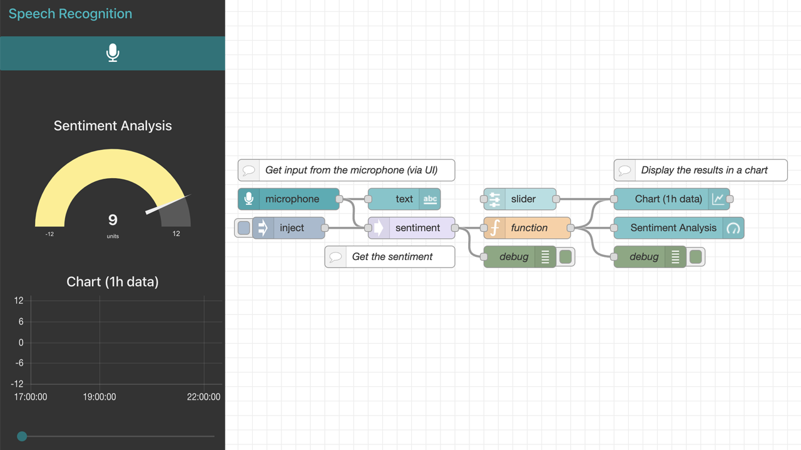
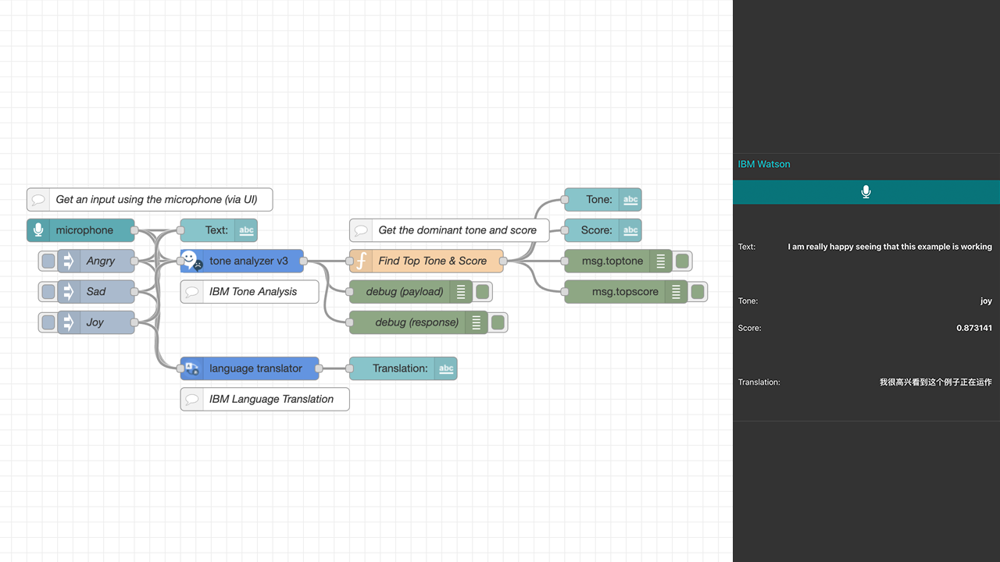

# NodeRED-Snippets
A collection of snippets using Node-RED:

- 01_MQTT Network (with custom function)

- 02_RGB Control via UI and MQTT

- 03_Weather (simple)

- 04_Weather (full)

- 05_Get News API

- 06_Sentiment Analysis

- 07_Sentiment Analysis (MQTT)

- 08_Sentiment Analysis (bot)

- 09_Sentiment Analysis (STT)

- 10_Tone Analysis and Translation with IBM Watson

- 11_Sunrise, Sunset

- 12_RapidAPI

- 13_IFTTT

